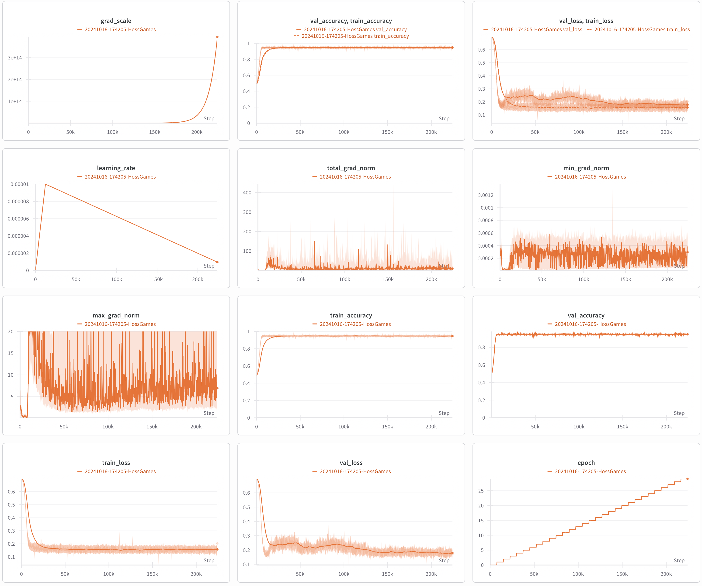

# CheatCode - Transformer-based Market Prediction

An ambitious attempt to build a transformer model from scratch for predicting market movements across multiple timeframes.

## The Question That Drove This Project

"Can I build a transformer from scratch to predict market movements? What does it really take to train these models?"

## Overview

I thought I could beat the big trading firms by training an AI model. This project involved building a custom transformer architecture to predict trading signals across different price bands and time horizons based on multi-timescale OHLCV (Open, High, Low, Close, Volume) data.

Spoiler: I couldn't beat the market, but I learned invaluable lessons about transformer architectures and training at scale.

Note: the training data set evolved and morphed over time, so the specific numbers of data points and whatnot across the project will be unreliable.

## Technical Implementation

### Model Architecture

- **Custom Transformer**: Built from scratch in PyTorch with separate encoder configurations for input and post-cross-attention processing
- **Dual-Ticker Processing**: Parallel transformer encoders for ES and NQ futures with cross-attention mechanism
- **Positional Encoding**: Custom implementation for 1440-minute (24-hour) sequences
- **Multi-horizon Output**: Predicts "dubba" signals (2:1 reward:risk trades) across 30 price bands × 30 minutes = 900 predictions per ticker
- **Architecture Details**:
  - Input transformers: Configurable d_model, nhead, and feedforward dimensions
  - Cross-ticker attention: Captures correlations between ES and NQ
  - Post-cross-attention transformers: Separate configuration for enhanced flexibility
  - Activation: Mish activation throughout
- **Design Process**: Used o3 to develop initial architecture spec, Claude 3.5 Sonnet and GPT-4o for implementation

### Data Pipeline

**Data Source**:

- DataBento purchase of tick-by-tick /ES and /NQ futures data
- 5 years of minute-by-minute trading data

**Storage Evolution**:

1. **PostgreSQL**: Initial attempt with heavy indexing
   - Problem: Couldn't feed GPU fast enough, even with RTX 4080 Super
   - Worse with rented A6000 Ada and H100

2. **HDF5 Solution**: Preprocessed entire dataset
   - 120GB HDF5 file with LZF compression
   - 1-minute OHLCV candles with 15 features per candle:
     - OHLCV data (5 features)
     - Sinusoidal time embeddings (10 features): time of day, day of week, day of month, day of year, minute of hour
   - Market closed periods: Zero-volume point-price candles
   - Successfully fed even H100 at full speed
   - Supports resumable dataset creation and parallel data loading

### Training Infrastructure

- **Local**: RTX 4080 Super
- **Cloud**: Tested on A6000 Ada, H100
- **Training Features**:
  - Mixed precision training with BFloat16 autocasting
  - Gradient scaling and clipping
  - AdamW optimizer with linear warmup scheduler
  - Binary cross-entropy loss with optional positive weight balancing
  - Checkpoint saving with model configuration persistence
  - Resume training capability with optimizer/scheduler state preservation
- **Data Loading**: Multi-worker DataLoader with prefetching for optimal GPU utilization
- **Monitoring**: Weights & Biases integration for loss, accuracy, gradient norms, and learning rate tracking
- **Key Learning**: Transformers are COSMICALLY hungry for data

## Results

- Model trained successfully with stable loss curves
- Some signal prediction capability emerged
- Backtesting showed patterns but no consistent edge
- Kept my day job 😄

## What I Learned

### Technical Insights

1. **Data Pipeline is Everything**: Database → GPU bandwidth becomes the bottleneck
2. **Preprocessing Trade-offs**: HDF5 requires upfront work but enables fast training
3. **Scale Matters**: 120GB seemed large until the model consumed it hungrily
4. **Architecture Design**: Building transformers from scratch deepens understanding

### Practical Insights

1. **Market Prediction is Hard**: Shocking, I know
2. **Compute Costs Add Up**: H100 time isn't cheap when you're self-funding
3. **Tools Matter**: Good monitoring (W&B) essential for long training runs

## Key Implementation Details

### Data Representation
- **Relative Pricing**: All OHLC data normalized to period close price (close = 1.0)
- **Time Encoding**: 10 sinusoidal features capturing cyclical patterns (minute, hour, day, week, year)
- **Market Closed Handling**: Zero-volume point-price candles maintain continuous time series

### Training Pipeline
- **Optimizer**: AdamW with β=(0.9, 0.98), eps=1e-6
- **Scheduler**: Linear warmup (5% of total steps) then linear decay
- **Loss**: Binary cross-entropy with optional positive weight balancing
- **Validation**: Every 10 training steps for real-time monitoring
- **Checkpointing**: Periodic saves with full state preservation

## Why This Project Matters

Building a transformer from scratch for a real-world problem (even unsuccessfully) provides unique insights:

- **Architecture Understanding**: Implementing attention mechanisms, positional encodings, and multi-head structures from first principles
- **Scale Challenges**: Moving from toy datasets to 120GB of real data exposes infrastructure bottlenecks
- **End-to-End ML**: From data collection through model serving, understanding the full pipeline
- **Practical Constraints**: Balancing model complexity with training costs and time

## Technical Stack

- **Framework**: PyTorch (custom transformer implementation)
- **Data Pipeline**: 
  - PostgreSQL for initial storage
  - HDF5 for training (with h5py)
  - Custom dataset class with caching and parallel loading
- **Key Libraries**: transformers (schedulers only), wandb, h5py, tqdm
- **Hardware**: RTX 4080 Super, A6000 Ada, H100 (rented)
- **Monitoring**: Weights & Biases
- **Languages**: Python, SQL

## Architecture Decisions

1. **Dual-Stage Transformer Design**: 
   - Input transformers process each ticker independently
   - Cross-attention mechanism learns inter-market correlations
   - Post-transformers refine the combined representation
2. **Positional Encoding**: Custom sinusoidal encoding for 1440-minute sequences
3. **Flexible Architecture**: Separate hyperparameters for input and post transformers (d_model, nhead, feedforward dimensions)
4. **Output Design**: Binary classification across 900 outputs per ticker for multi-horizon trading signals
5. **Training Strategy**:
   - 90/10 train/validation split with shuffling
   - Fixed 1-minute sliding window for data generation
   - ~524,160 training samples from 52 weeks of data

## Reflections

Building a transformer from scratch to solve a real problem (even if unsuccessfully) provided insights that reading papers alone never could. Understanding the hunger for data, the importance of pipeline optimization, and the subtle architectural decisions that affect training dynamics - these lessons directly inform my thinking about LLM capabilities and limitations.

The project failed at its stated goal but succeeded in deepening my understanding of the technology that powers modern AI. Sometimes the best way to understand something is to build it yourself.

---

*Built to answer: "How hard could market prediction be?" Answer: Very.*

## Project Structure

```
transformer_model/
├── src/
│   ├── cheat_code_model.py    # Core transformer implementation
│   ├── train.py               # Training pipeline with W&B integration
│   ├── dataset.py             # HDF5 dataset handling
│   ├── inference.py           # Model inference utilities
│   └── extract_training_data.py # Data preprocessing
├── requirements.txt           # Python dependencies
└── schema.pgsql              # PostgreSQL schema (initial approach)
```

## Stats from one of the better training runs

This run was performed with a subset of the full data set.
